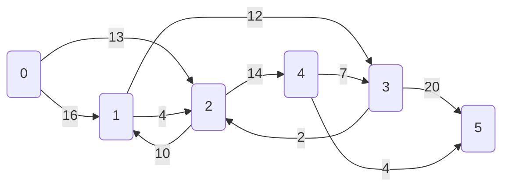

# Flux maxim

Problema fluxului maxim spune ca intr-un graf orientat ponderat, avand un nod 
de plecare S (source node) si un nod destinatie D (sink node), vrem sa aflam 
care este cantitatea maxima (sa zicem de apa) pe care o putem trimite de la S la D.

Hai sa luam urmatorul exemplu:

Algoritmi care rezolva aceasta problema:
* Ford-Fulkerson
* Edmonds-Karp
* Dinic
* Preflow-push / push-relabel

https://cp-algorithms.com/graph/edmonds_karp.html

