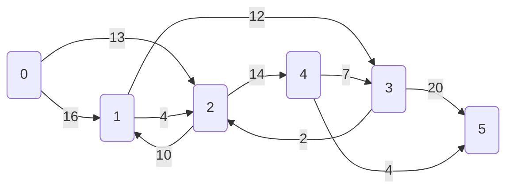

# Flux maxim

Hai sa luam urmatorul exemplu:

https://cp-algorithms.com/graph/edmonds_karp.html

Definitie formala: O retea de flux este un fraf orientat G(V, E), avand numai muchii cu capacitati pozitive, daca o muchie nu exista spunem ca are capacitate 0, un nod sursa si unul destinatie.
**Conditie importanta:** Orice nod care nu e sursa sau destinatie trebuie sa se afle pe minim un drum de la s la t. Altfel, avem noduri izolate care nu au sens sa se afle in retea.

Fie functia $f : V \times V \to \mathbb{R}$ care atribuie o capacitate fiecarui arc.

Proprietate 1: Fluxul printr-un arc nu poate depasi capacitatea arcului

Proprietate 2: f(u, v) = -f(u, v)

Proprietate 3: Fluxul se conserva: $\sum f(u, v) = 0, \quad \forall u \in V \setminus \{S, D\}$ 

### Surse multiple si destinatii multiple

In cazul in care avem mai multe surse $\{s_1, s_2, \dots, s_n\}$ si mai multe destinatii $\{d_1, d_2, \dots, d_m\}$, putem reduce la o singura sursa si destinatie astfel:
- introducem o super-sursa S cu arce de capacitate infinita spre fiecare sursa reala
- introducem o super-destinatie D, fiecare destinatie avand cate un arc de capacitate infinita spre D

## Rezolvare tinand cont de partea *reziduala*

**Arc rezidual:** Un arc (u, v) se numeste rezidual daca fluxul pe el nu a atins capacitatea maxima (adica prin el se mai poate trimite un flux suplimentar).

**Capacitate reziduala:** Capacitatea reziduala este egala cu capacitatea reala a unui arc minus fluxul trimis pe acest arc.

**Retea reziduala:** $G_f = (V, E_f) \text{ unde } E_f = \{(u,v) \in V \times V \; | \; c_f(u,v) > 0 \}$

Este reteaua formata din toate arcele pe care mai poti mari fluxul.

Observatie critica: $E_f \not\subset E$ - Reteaua reziduala poate contine arce care nu exista initial in graful original. Aceste arce sunt cele cu minus practic: drum (u, v) cu $f(u, v) > 0$ atunci exista un arc rezidual cu $c_f(v, u) = f(u, v) > 0$, fiind practic o implicatie directa a faptului ca poti anula fluxul trimis anterior inversand directia. 

