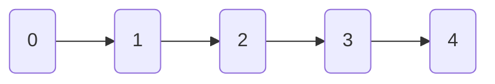

# Sortare Topologica (TopoSort)

Sortarea topologica este o ordonare liniara a unui graf orientat, astfel incat 
daca avem o muchie $(u, w)$, atunci $w$ va aparea dupa $u$ in sortarea 
topologica.

Exemplu



Exista 2 moduri de a implementa

## Algoritmul lui Kahn -- folosind BFS

```java
static List<Integer> topoSort(int n, List<List<Integer>> graph) {
    int[] indegree = new int[n];
    List<Integer> sorted = new ArrayList<>(n);

    for (int i = 0; i < n; i++) {
        for (var neigh : graph.get(i)) {
            indegree[neigh]++;
        }
    }

    Queue <Integer> queue = new ArrayDeque<>();

    for (int i = 0; i < n; i++)
        if (indegree[i] == 0)
            queue.add(i);
    
    while (!queue.isEmpty()) {
        int curr = queue.poll();
        
        sorted.add(curr);

        for (var neigh : graph.get(curr)) {
            indegree[neigh]--;

            if (indegree[neigh] == 0)
                queue.add(neigh);
        }
    }

    return sorted;
}
```

## Sortare topologica folosind DFS

```java
static void topoSortDFS(int curr, List<List<Integer>> graph, Deque<Integer> sorted, boolean[] marked) {
    marked[curr] = true;

    for (var neigh : graph.get(curr)) {
        if (marked[neigh])
            continue;

        topoSortDFS(neigh, graph, sorted, marked);
    }

    sorted.addLast(curr);
}

public static void main(String[] args) {
    // Citeste valorile

    boolean[] marked = new boolean[n];
    for (int i = 0; i < n; i++)
        if (!marked[i])
            topoSortDFS(i, graph, sorted, marked);

    // sortarea topologica este practic in ordinea inversa de pe stack
    while (!sorted.isEmpty()) {
        System.out.print(sorted.pollLast() + " ");
    }
}
```
