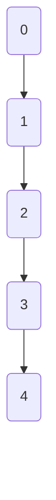

# Teorie PA

**Autor**: Predescu Sebastian-Ion
**Grupa**: 322CC

## Cuprins

- [Programare dinamica](#programare-dinamica)
- [Backtracking](#backtracking)
- [Grafuri](#grafuri)
  - [BFS - Breadth-First Search](#bfs---breadth-first-search)
  - [DFS - Depth-First Search](#dfs---depth-first-search)
  - [Componente Conexe, Tare-Conexe, Biconexe](#componente-conexe-tare-conexe-biconexe)
  - [Sortare Topologica (TopoSort)](#sortare-topologica-toposort)
    - [Algoritmul lui Kahn -- folosind BFS](#algoritmul-lui-kahn----folosind-bfs)
    - [Sortare topologica folosind DFS](#sortare-topologica-folosind-dfs)
  - [Tarjan algorithm](#tarjan-algorithm)
    - [Tarjan SCC (strongly connected components)](#tarjan-scc-strongly-connected-components)
    - [Tarjan CV (cut vertex)](#tarjan-cv-cut-vertex)
    - [Tarjan CE (critical edges)](#tarjan-ce-critical-edges)
    - [Tarjan BCC (biconex...)](#tarjan-bcc-biconex)
  - [Kosaraju](#kosaraju)
  - [Dijkstra](#dijkstra)
  - [Bellman-Ford](#bellman-ford)
  - [Roy-Floyd (Floyd-Warshall)](#roy-floyd-floyd-warshall)
  - [Johnson](#johnson)
  - [Kruskal](#kruskal)
  - [Prim](#prim)
  - [Karger, Klein & Tarjan -- Algoritmi randomizati pentru APM](#karger-klein--tarjan----algoritmi-randomizati-pentru-apm)
  - [Bernard Chazelle -- Algoritm determinist cu o complexitate liniara](#bernard-chazelle----algoritm-determinist-cu-o-complexitate-liniara)

---

- [ ] BFS
- [ ] DFS
- [x] TopoSort
- [>] Tarjan
- [x] Korsajaru
- [x] Dijkstra
- [x] Bellman-Ford
- [x] Floyd-Warshall
- [ ] Jonhson

# Programare dinamica

# Backtracking

# Grafuri

## BFS - Breadth-First Search

## DFS - Depth-First Search

## Componente Conexe, Tare-Conexe, Biconexe

Componenetele tare-conexe sunt sunt componenete intr-un graf orientat in care 
din orice nod se poate ajunge in orice alt nod si vice-versa.

## Sortare Topologica (TopoSort)

Sortarea topologica este o ordonare liniara a unui graf orientat, astfel incat 
daca avem o muchie $(u, w)$, atunci $w$ va aparea dupa $u$ in sortarea 
topologica.

Exemplu



Exista 2 moduri de a implementa

### Algoritmul lui Kahn -- folosind BFS

```java
static List<Integer> topoSort(int n, List<List<Integer>> graph) {
    int[] indegree = new int[n];
    List<Integer> sorted = new ArrayList<>(n);

    for (int i = 0; i < n; i++) {
        for (var neigh : graph.get(i)) {
            indegree[neigh]++;
        }
    }

    Queue <Integer> queue = new ArrayDeque<>();

    for (int i = 0; i < n; i++)
        if (indegree[i] == 0)
            queue.add(i);
    
    while (!queue.isEmpty()) {
        int curr = queue.poll();
        
        sorted.add(curr);

        for (var neigh : graph.get(curr)) {
            indegree[neigh]--;

            if (indegree[neigh] == 0)
                queue.add(neigh);
        }
    }

    return sorted;
}
```

### Sortare topologica folosind DFS

```java
static void topoSortDFS(int curr, List<List<Integer>> graph, Deque<Integer> sorted, boolean[] marked) {
    marked[curr] = true;

    for (var neigh : graph.get(curr)) {
        if (marked[neigh])
            continue;

        topoSortDFS(neigh, graph, sorted, marked);
    }

    sorted.addLast(curr);
}

public static void main(String[] args) {
    // Citeste valorile

    boolean[] marked = new boolean[n];
    for (int i = 0; i < n; i++)
        if (!marked[i])
            topoSortDFS(i, graph, sorted, marked);

    // sortarea topologica este practic in ordinea inversa de pe stack
    while (!sorted.isEmpty()) {
        System.out.print(sorted.pollLast() + " ");
    }
}
```

## Tarjan algorithm

> [!NOTE]
> Algoritmul lui Tarjan este foarte versatil si poate fi adaptat
> Acesta poate gasi: componentele tare conexe, nodurile critice, muchiile critice etc.

Ideea de baza a algoritmului:
- Un DFS produce un arbore din graful initial
- SCC-urile sunt subarbori ai arborelui produs de DFS
- Mai avem doar de gasit **radacina** din fiecare SCC

Pentru a gasi radacina, trebuie sa definim:
* `time[node]` = timpul la care am ajuns la nodul *node* prin dfs 
(al catelea nod in parcurgere)
* `low[node]` = cel mai mic `time` accesibil din subarborele lui *node* in 
arborele DFS, folosind oricate muchii din arbore si cel mult o muchie de intoarcere

Initial, `low[node] = time[node]`, dar, dupa se actualizeaza in timp ce parcurgem:
* low[node] = min(low[node], low[fiu])
* low[node] = min(low[node], time[stramos])

Totusi, pentru a functiona algoritmul, acesta necesita si o stiva, care reprezinta 
toate nodurile care sunt in curs de vizitare si nu apartin unui SCC inca. Asadar, 
in momentul in care gasim un SCC, scoatem toate nodurile de pe stiva. Acest lucru 
ne ajuta sa limitam putin low-ul, comparandu-l cu timpul unui stramos **NUMAI** 
daca stramosul se afla pe stiva. Daca nu se afla, atunci apartine deja unui SCC 
si nu mai prezinta interes.

Nodul *node* este radacina daca `low[node] = time[node]` dupa ce s-a terminat 
parcurgerea. Aceasta inseamna ca nu exista niciun nod care sa poata *urca* mai 
sus in arbore, sunt toate captive in SCC-ul curent.

### Tarjan SCC (strongly connected components)

Implementare
```java
static void tarjanSCC(
    int curr, 
    List<List<Integer>> graph, 
    Deque<Integer> stack,  
    boolean[] onStack, 
    int[] time, 
    int[] low, 
    int[] currTime, 
    List<List<Integer>> SCC
) {
    time[curr] = currTime[0]++;
    low[curr] = time[curr];
    stack.addLast(curr);
    onStack[curr] = true;

    for (Integer neigh : graph.get(curr)) {
        if (time[neigh] == -1) {
            // Case 1 - we did not visited this, so it's a node in curr subtree
            tarjanSCC(neigh, graph, stack, onStack, time, low, currTime, SCC);
            low[curr] = Integer.min(low[curr], low[neigh]);
        } else if (onStack[neigh]) {
            // Case 2 - we found an ancestor (back edge)
            low[curr] = Integer.min(low[curr], time[neigh]);
        }
    }


    // time to check if this is the head of a SCC
    if (low[curr] != time[curr])
        return;

    // found the SCC
    SCC.add(new ArrayList<>());

    while (!stack.isEmpty()) {
        int node = stack.pollLast();

        onStack[node] = false;
        SCC.getLast().add(node);
        if (node == curr) break;
    }
}

public static void main(String[] args) {
    // Read the graph or hard code it

    // Initialise the SCC, time (with -1), low, onStack, stack

    // start the tarjan SCC alg just like a normal DFS

    // Congrats! You now have all strongly connected components

    // Java don't support sending primitives as reference
    // Also Integer type is immutable
    // So a great trick for getting around this limitation is 
    // either to have a static field in the class
    // or to make an array int[] currTime = {0} with a size of 1
    // and use it as a single int
}
```

### Tarjan CV (cut vertex)

```java
static void tarjanCV(
    int curr, 
    List<List<Integer>> graph, 
    int parent,
    int[] time, 
    int[] low, 
    int[] currTime, 
    boolean[] isCutVertex
) {
    time[curr] = low[curr] = currTime[0]++;
    int children = 0;

    for (int neigh : graph.get(curr)) {
        if (time[neigh] == -1) {
            children++;
            tarjanCV(neigh, graph, curr, time, low, currTime, isCutVertex);
            low[curr] = Integer.min(low[curr], low[neigh]);

            // Conditia pentru cut vertex
            if (parent != -1 && low[neigh] >= time[curr])
                isCutVertex[curr] = true;
        } else if (neigh != parent) {
            // Back edge
            low[curr] = Integer.min(low[curr], time[neigh]);
        }
    }

    // conditia pentru root
    if (parent == -1 && children > 1) {
        isCutVertex[curr] = true;
    }
}
```

### Tarjan CE (critical edges)

```java
record Muchie(int from, int to) {}

static void tarjanCE(
    int curr,
    List<List<Integer>> graph,
    int parent,
    int[] time, int[] low, int[] currTime, 
    List<Muchie> bridges
) {
    time[curr] = low[curr] = currTime[0]++;

    for (int neigh : graph.get(curr)) {
        if (time[neigh] == -1) {
            tarjanCE(neigh, graph, curr, time, low, currTime, bridges);

            low[curr] = Integer.min(low[curr], low[neigh]);

            // Conditie pentru bridge - strict mai mare
            if (low[neigh] > time[curr])
                bridges.add(new Muchie(curr, neigh));
        } else if (neigh != parent) {
            low[curr] = Integer.min(low[curr], time[neigh]);
        }
    }
}
```

### Tarjan BCC (Biconnected Components)

O componenta biconexa este o componenta care:
* este conexa
* Nu are niciun cut vertex: oricum elimini un nod, componenta ramane conexa

```java
static void tarjanBCC(
    int curr, 
    List<List<Integer>> graph, 
    Deque<Integer> stack,
    int parent,
    int[] time, 
    int[] low, 
    int[] currTime, 
    List<List<Integer>> BCC
) {
    time[curr] = low[curr] = currTime[0]++;
    stack.addLast(curr);

    for (Integer neigh : graph.get(curr)) {
        if (time[neigh] == -1) {
            // Case 1 - we did not visited this, so it's a node in curr subtree
            tarjanBCC(neigh, graph, stack, curr, time, low, currTime, BCC);
            low[curr] = Integer.min(low[curr], low[neigh]);

            if (low[neigh] >= time[curr]) {
                // found a BCC
                List<Integer> newBCC = new ArrayList<>();
                newBCC.add(curr);
                
                while (!stack.isEmpty()) {
                    int node = stack.pollLast();

                    newBCC.add(node);
                    if (node == neigh)
                        break;
                }

                BCC.add(newBCC);
            }
        } else if (neigh != parent) {
            // Case 2 - we found an ancestor (back edge)
            low[curr] = Integer.min(low[curr], time[neigh]);
        }
    }
}
```

## Kosaraju

> [!NOTE]
> Definim un arbore de afundare (sink tree) al nodului T:
> Arbore in care exista un drum din orice nod in T, dar T nu duce intr-un niciun nod

Kosaraju este un algoritm care gaseste toate componenetele tare-conexe intr-un 
graf orientat.

O varianta directa si neoptima a rezolvarii acestei probleme, este 
brute-force-ul, prin care daca isPath(x, y) && isPath(y, x) atunci x si y se 
afla in aceeasi componenta tare conexa.

Varianta imbunatatita este algoritmul `Kosaraju`: definim timpul de terminare a 
unui nod intr-o parcurgere DFS in momentul in care am terminat de vizitat toti 
vecinii sai (cand ne intoarcem de pe recursivitate). Putem mentine intr-o stiva 
ordinea.

De exemplu, daca avem graful $1$ &rarr; $2$ &rarr; $3$ &rarr; 4 atunci ordinea 
de pe stiva va fi ${4, 3, 2, 1}$.

La ce ne ajuta aceasta *stiva*? Daca am porni de la nodul $4$ catre nodul $1$, 
am avea automat componentele tare-conexe, doar ca in practica este imposibil 
sa gasim nodurile optime din care sa pornim pentru a gasi rezultatul. Asadar, 
pentru a compensa, creem graful transpus (intoarcem muchiile) si parcurgem in 
ordinea inversa de pe stiva.

**De ce aceasta parcurgere ne da componentele?** Daca un nod X face parte din 
SCC1 si un nod Y face parte din SCC2 si exista muchie de la X la Y, atunci toate 
nodurile din componenta SCC1 isi vor termina parcurgerea dupa Y (vor aparea in 
stiva dupa Y). Nodurile cu finish time mare in graful original devin puncte de 
start in graful transpus. In graful transpus, muchiile intre SCC-uri sunt 
inversate, deci un DFS pornit dintr-un nod cu finish time mare nu poate 'scapa' 
in alt SCC — ramane captiv in propriul SCC. Deci, la fiecare DFS complet pe 
graful transpus (pornind din varful stivei), obtinem exact un SCC.

Implementare
```java
static void dfs_stack(int curr, List<List<Integer>> graph, Deque<Integer> stack, boolean[] marked) {
    marked[curr] = true;

    for (Integer neigh : graph.get(curr)) {
        if (marked[neigh])
            continue;

        dfs_stack(neigh, graph, stack, marked);
    }

    stack.addLast(curr);
}

static void dfs_transposed(int curr, List<List<Integer>> graph, List<Integer> SCC, boolean[] marked) {
    marked[curr] = true;
    SCC.add(curr);

    for (Integer neigh : graph.get(curr)) {
        if (marked[neigh])
            continue;

        dfs_transposed(neigh, graph, SCC, marked);
    }
}

static List<List<Integer>> kosaraju(int n, List<List<Integer>> graph) {
    // step 1 -- Create that stack using a classic DFS
    boolean[] marked = new boolean[n];
    Deque<Integer> stack = new ArrayDeque<>(n);
    
    for (int i = 0; i < n; i++) {
        if (marked[i] == true)
            continue;

        dfs_stack(i, graph, stack, marked);
    }

    // step 2 -- create the transpose graph
    List<List<Integer>> transposedGraph = new ArrayList<>(n);
    
    for (int i = 0; i < n; i++)
        transposedGraph.add(new ArrayList<>());

    for (int i = 0; i < n; i++) {
        for (Integer neigh : graph.get(i))
            transposedGraph.get(neigh).add(i);
    }

    // step 3 -- now dfs over the transposed graph in the stack order
    Arrays.fill(marked, false);

    List<List<Integer>> SCC = new ArrayList<>();

    while (!stack.isEmpty()) {
        int currNode = stack.pollLast();

        if (marked[currNode])
            continue;

        SCC.add(new ArrayList<>());
        dfs_transposed(currNode, transposedGraph, SCC.getLast(), marked);
    }

    return SCC;
}
```

## Dijkstra

Rezolva problema `cel mai scurt drum` de la un nod src la orice alt nod din 
graf. **Acest algoritm nu merge pentru muchii negative**.

Acesta este relativ simplu: mentin continuu o coada de prioritati (pentru insert 
si pop rapid) cu distanta de la nodul src la celelalte noduri (dam push la 
$\{dist[x], x\}$), sortam dupa distanta si dupa vizitam vecinii nodului cu 
distanta minima. Daca putem ajunge la un vecin de a lui $x$ mai rapid, atunci 
modificam distanta si adaugam in coada.

Implementare:
```java
record Elem(int dist, int node) {}

record Muchie(int to, int cost) {}

static int[] dijkstra(int n, int src, List<List<Muchie>> graph) {
    int[] dist = new int[n];

    Arrays.fill(dist, Integer.MAX_VALUE);
    dist[src] = 0;

    PriorityQueue<Elem> queue = new PriorityQueue<>((elem1, elem2) -> elem1.dist() - elem2.dist());
    queue.add(new Elem(0, src));

    while (!queue.isEmpty()) {
        Elem curr = queue.poll();

        // optimizare
        // daca deja avem o distanta mai buna decat cea din coada, sarim peste
        if (curr.dist() > dist[curr.node()])
            continue;

        for (Muchie neigh : graph.get(curr.node())) {
            if (dist[neigh.to()] > curr.dist() + neigh.cost()) {
                dist[neigh.to()] = curr.dist() + neigh.cost();
                queue.add(new Elem(dist[neigh.to()], neigh.to()));
            }
        }
    }

    return dist;
}
```

## Bellman-Ford

Rezolva problema `cel mai scurt drum` de la un nod src la orice alt nod din 
graf, chiar si cu muchii de cost negativ. Intoarce $-1$ in cazul ciclurilor 
negative.

Ne putem da seama ca avem un ciclu negativ, daca suma muchiilor unui ciclu este 
negativa. In acel moment, cu fiecare parcurgere facuta, costul va deveni din ce 
in ce mai mic.

Ceea ce face diferit de Dijkstra este sa reviziteze nodurile care au fost deja 
marcate ca fiind vizitate, deoarece poate exista o ruta mai lunga ca numar de 
noduri, dar mai scurt dat fiind existenta muchiilor negative.

**Principiul relaxarii muchiilor**: Daca gasim o ruta mai scurta catre un nod 
$x$ prin intermediul altui $(u, w)$, unde $w$ este costul muchiei, atunci 
relaxez distanta pana la $x$ cu $dist[x] = dist[u] + w$.

In urma a $N - 1$ relaxari, vom afla distanta minima de la src la toate nodurile 
pentru ca orice distanta poate avea maxim poate trece prin maxim toate nodurile, 
insemnand $N - 1$ muchii. Altfel, deja avem cicluri.

Implementare:
```java
class Muchie {
    int src, dst, cost;
}

static int[] bellmanFord(Muchie[] edges, int n, int src) {
    int[] dist = new int[n];
    
    Arrays.fill(dist, Integer.MAX_VALUE);
    dist[src] = 0;

    // In mod normal ar trebui sa face n - 1 relaxari
    // Putem, totusi, sa adaugam inca o relaxare pentru a prinde cazul in care 
    // avem un ciclu negativ
    // Practic, ce face o relaxarea numarul T, este sa ne asigure ca dist[node] 
    // este distanta minima de la src la node ce trece prin maxim T muchii
    for (int relaxation = 1; relaxation <= n; relaxation++) {
        for (Muchie edge : edges) {
            int x = edge.src, y = edge.dst, c = edge.cost;
            
            // Verificam daca putem actualiza dist[y] prin (x, c)
            if (dist[x] != Integer.MAX_VALUE && dist[x] + c < dist[y]) {
                dist[y] = dist[x] + c;

                // Verificam daca este un ciclu negativ
                // Daca nu avem niciun astfel de ciclu, atunci la relaxarea n
                // nu ar trebui sa mai avem nimic de actualizat
                if (relaxation == n)
                    return new int[]{-1};
            }
        }
    }

    return dist;
}
```

## Roy-Floyd (Floyd-Warshall)

Rezolva problema `cel mai scurt drum` intr-un graf dens. Acesta gaseste toate 
perechile de drumuri intre oricare 2 noduri din graf.

Ideea algoritmului: <br>
$dist[x][y]$ = drumul minim de la $x$ la $y$ <br>
$dist[x][y] = min(dist[x][y], dist[x][k] + dist[k][y])$<br>
Practic, folosim nodul k ca intermediar

Initializam 
$$
dist[x][y] = 
\begin{cases}
cost & \text{cand exista o muchie intre x si y} \\
INF & \text{daca nu exista muchie} \\
0 & x = y
\end{cases}
$$

```java
static void floydWarshall(int[][] dist) {
    int n = dist.length;
    int INF = Integer.MAX_VALUE;

    // alegem nodul K ca fiind intermediar
    for (int k = 0; k < n; k++)
        // alegem sursa
        for (int x = 0; x < n; x++)
            // alegem destinatia
            for (int y = 0; y < n; y++) {
                // distanta minima de la x la y
                if (dist[x][k] == INF || dist[k][y] == INF)
                    continue;

                dist[x][y] = Math.min(dist[x][y], dist[x][k] + dist[k][y]);
            }
}
```

Explicatia algoritmului:
1. Aleg nodul k ca fiind intermediar
2. Calculez drumul minim de la orice x la orice y, care trece printr-un nod 
intermediar din multimea $\{0, 1, \dots, k\}$
3. Stiu ca drumul va fi minim pentru ca de asemenea $dist[x][k]$ si $dist[k][y]$ 
sunt drumurile minime ce au un nod intemediar in multimea ${0, 1, \dots, k - 1}$


## Johnson

## Kruskal

## Prim

## Karger, Klein & Tarjan -- Algoritmi randomizati pentru APM

## Bernard Chazelle -- Algoritm determinist cu o complexitate liniara

